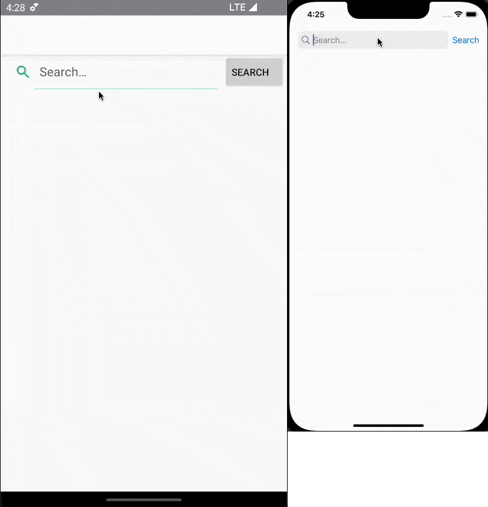

# Marvel Search

  

Marvel Search is a cross-platform app that implements MVVM with MvvmCross using Xamarin.Native.
It let users search for Marvel comics and see its details.

The aim of this project is to learn how to create a project with Xamarin.Native and to know how to implement MVVM in it.

### Requirements

It's necessary to add a keys file MarvelAPIKeys.cs under MarvelSearch.Core/Services/MarvelAPI with public and private keys of Marvel Developer API: https://developer.marvel.com/
